

  <h1 style="display: flex; align-items: center; justify-content: center; width: 100%;">
     반려동물 일상을 자랑하는 커뮤니티, 집사모여

  </h1>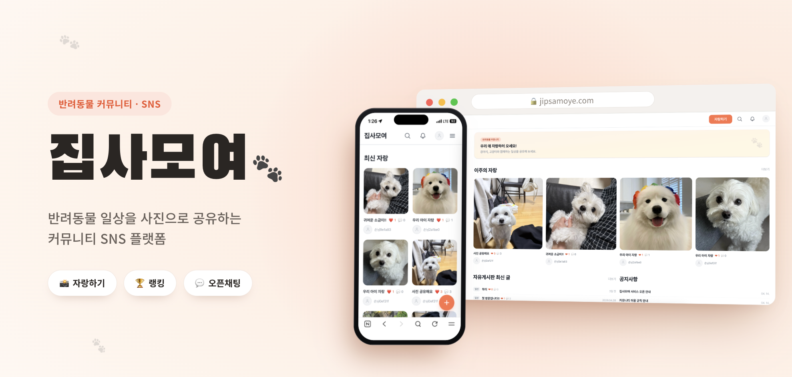
<!--   <h3>소개란</h3> -->
  <h3>반려동물 일상을 사진으로 공유하는 커뮤니티 SNS 플랫폼</h3>
  
2026.04.09 ~ 현재

  <h2>🐾 <a href="https://www.jipsamoye.com">집사모여 바로가기</a> 🐾</h2>

 

## 목차

1. [서비스 주요 기능](#서비스-주요-기능)
2. [프로젝트 설계](#프로젝트-설계)
3. [개발 환경 및 기술 스택](#개발-환경-및-기술-스택)
4. [팀원 소개](#팀원-소개)

 

## [서비스 주요 기능](#목차)

### 1️⃣ 메인 페이지 — 오늘의 멍냥

> 최근 24시간 좋아요 상위 게시글을 '오늘의 멍냥'으로 하이라이트하고, 최신 자랑글을 그리드로 보여줍니다.

|                          **Main Page**                          |
| :------------------------------------------------------------: |
| 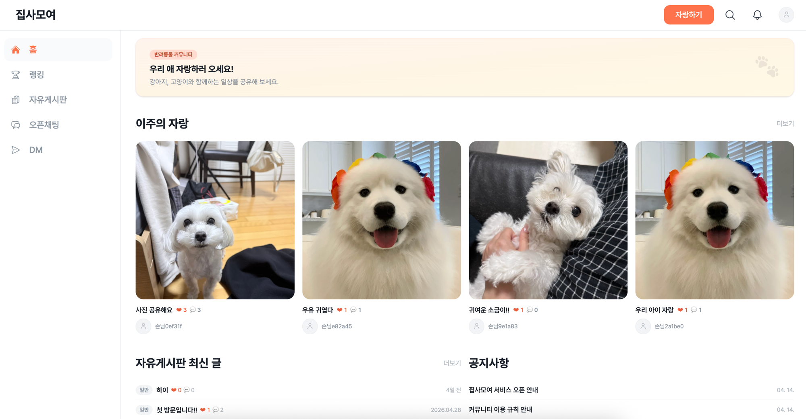 |

 

### 2️⃣ 게시글 (자랑하기)

> 제목·사진(최대 5장)·내용으로 반려동물 일상을 자랑할 수 있으며, 본인 게시글만 수정·삭제할 수 있습니다.

|                          **Post**                          |
| :--------------------------------------------------------: |
| 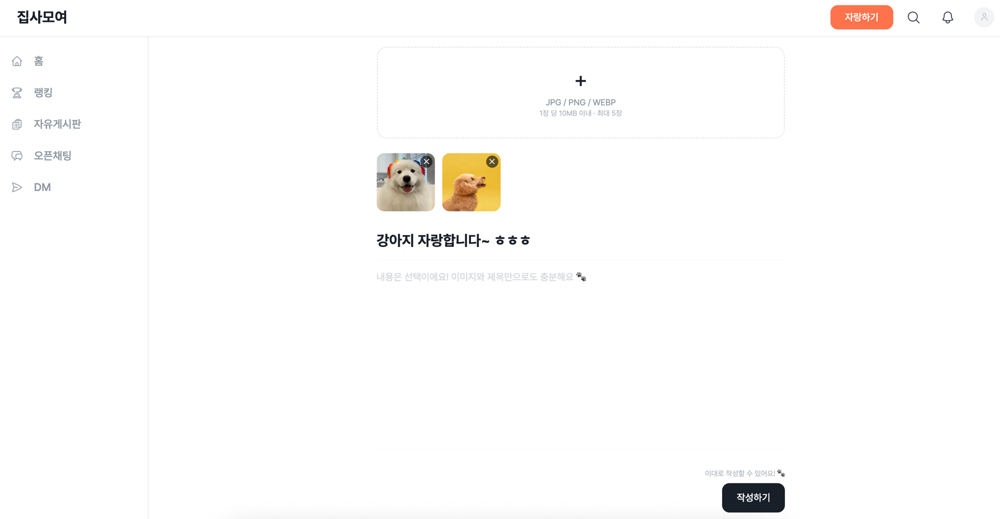 |

 

### 3️⃣ 좋아요 & 댓글

> 게시글에 좋아요(토글)와 댓글로 반응할 수 있습니다. 좋아요 수는 카드와 상세에 노출됩니다.

|                          **Like & Comment**                          |
| :-----------------------------------------------------------------: |
| 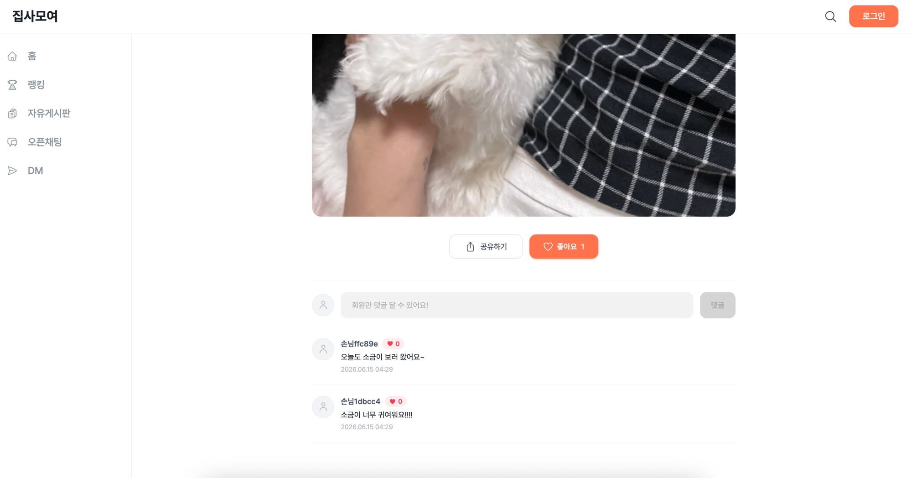 |

 

### 4️⃣ 팔로우

> 마음에 드는 집사를 팔로우하고, 팔로워·팔로잉 목록을 확인할 수 있습니다.

|                          **Follow**                          |
| :----------------------------------------------------------: |
| 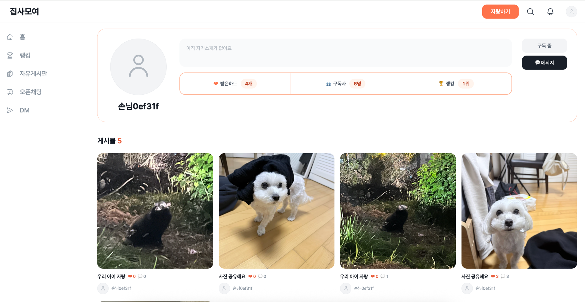 |

 

### 5️⃣ 검색

> 제목 기반 검색으로 원하는 자랑글을 빠르게 찾을 수 있습니다.

|                          **Search**                          |
| :----------------------------------------------------------: |
| 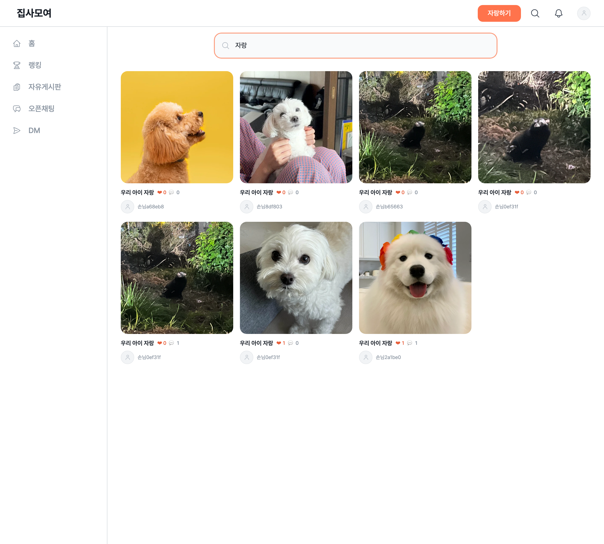 |

 

### 6️⃣ 소셜 로그인 & 둘러보기

> 네이버 OAuth 2.0 소셜 로그인을 지원하며, 로그인 없이도 게스트(둘러보기) 계정으로 주요 기능을 체험할 수 있습니다.

|                          **Login & Guest**                          |
| :----------------------------------------------------------------: |
| 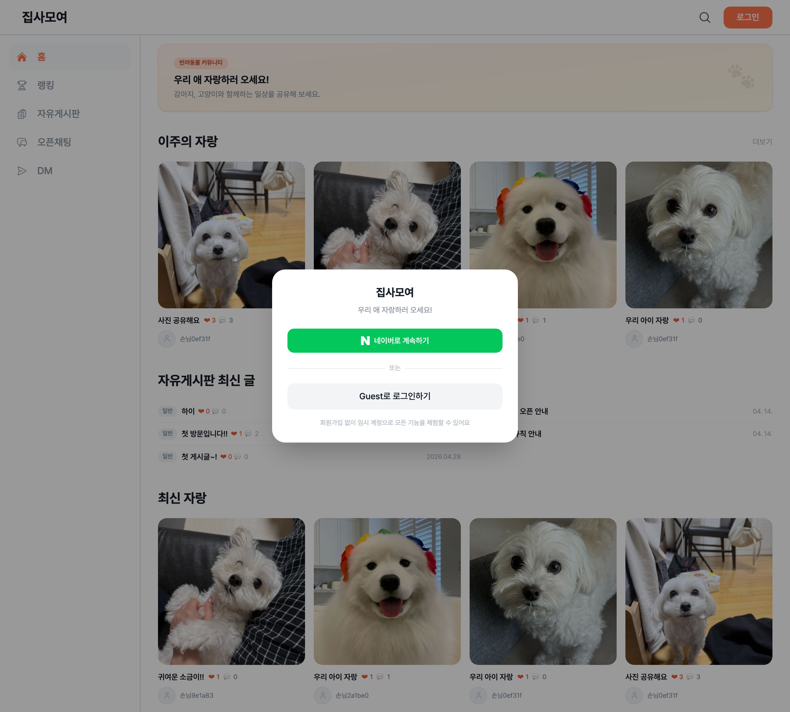 |

 

### 7️⃣ 알림

> 내 게시글에 달린 좋아요·댓글, 새 팔로우 등의 활동을 알림으로 확인할 수 있습니다.

|                          **Notification**                          |
| :---------------------------------------------------------------: |
| 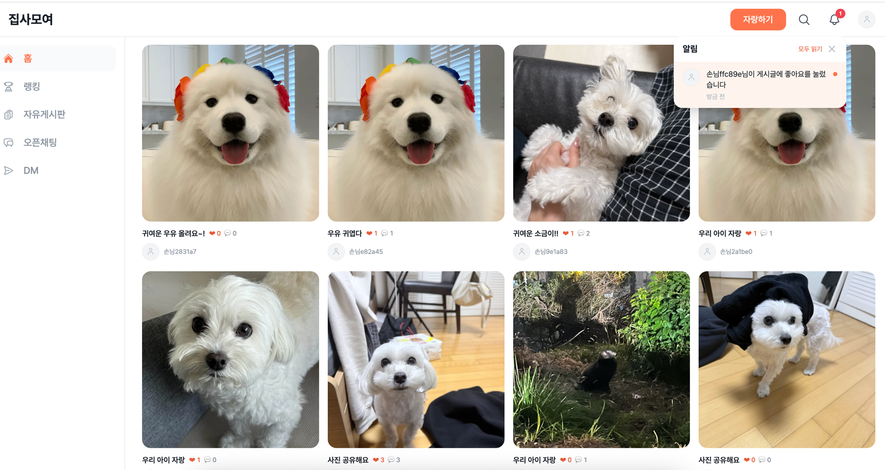 |

 

### 8️⃣ DM & 채팅

> 집사들끼리 1:1 다이렉트 메시지(DM)와 오픈채팅으로 실시간 소통할 수 있습니다.

|                          **DM**                          |                          **오픈채팅**                          |
| :------------------------------------------------------: | :-----------------------------------------------------------: |
| 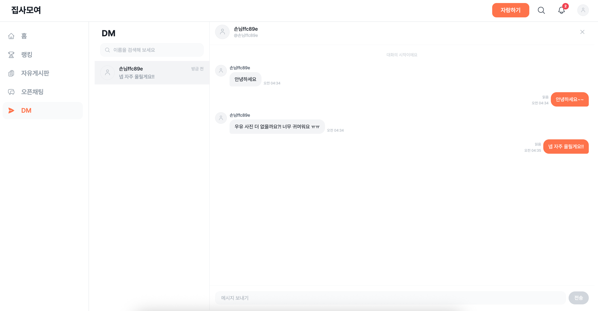 | 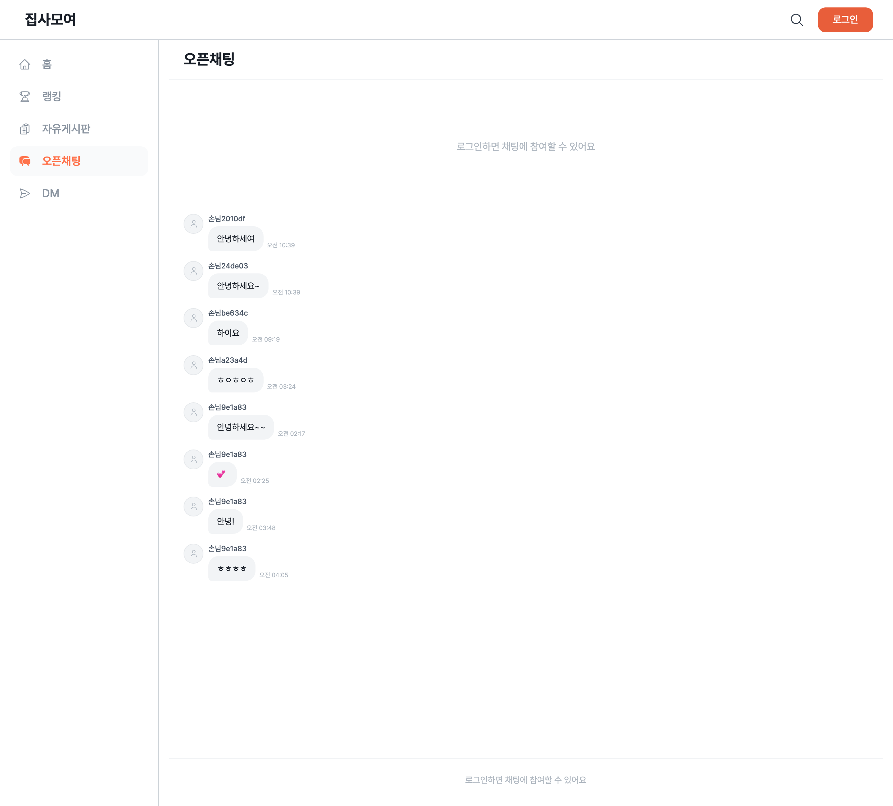 |

 

### 9️⃣ 자유게시판

> 자랑 외에도 일반·질문 카테고리의 자유게시판에서 정보를 나누고 소통할 수 있습니다.

|                          **Board**                          |
| :--------------------------------------------------------: |
| 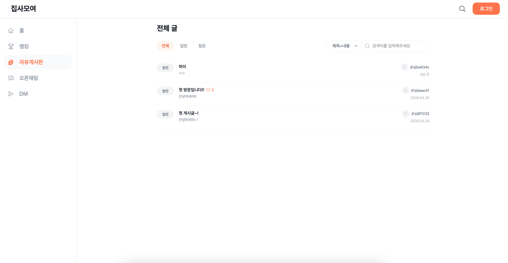 |

 
 

## [프로젝트 설계](#목차)

### 시스템 아키텍처

 
 

## [개발 환경 및 기술 스택](#목차)

|      개발 환경      | 기술 스택                                                                                                                                                                                                                                                                                                                                                                                                                                          |
| :-----------------: | :----------------------------------------------------------------------------------------------------------------------------------------------------------------------------------------------------------------------------------------------------------------------------------------------------------------------------------------------------------------------------------------------------------------------------------------------- |
|    **Frontend**     |                                                                                                                                                                                                                            |
|     **Backend**     |     |
|       **DB**        |                                                                                                                                                                                                                                                                                                                                                   |
|      **Infra**      |                                                                                                                                                                                                                    |
|     **CI / CD**     |                                                                                                                                                                                                                                                                                                                          |
| **Management Tool** |                                |

 
 

## [팀원 소개](#목차)

## **Contributors**

<table>
  <tr>
    <th>개발</th>
    <th>디자인</th>
  </tr>
  <tr>
    <td></td>
    <td></td>
  </tr>
  <tr align="center">
    <td><b>전영식</b></td>
    <td><b>심은혜</b></td>
  </tr>
</table>
